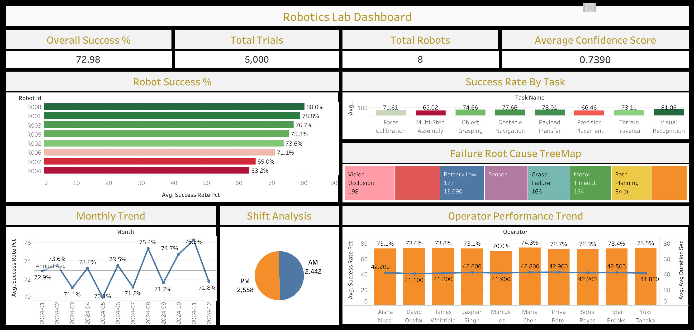

# Robotics Lab Operations Dashboard

## 📊 [View Live Dashboard](https://public.tableau.com/views/robotics-lab/Dashboard1)

---

## Business Context

In a high-throughput robotics lab, every failed trial costs time, delays research timelines, and consumes engineering resources. Lab supervisors need real-time visibility into which robots are underperforming, which tasks are hardest, and what is causing failures — so they can act before small issues become systemic problems.

> **The operational question: Where are we losing trials, and what do we do about it?**

This dashboard analyzes 5,000 robot trials across 8 robots, 10 operators, and 8 task types over a full calendar year to surface performance patterns and actionable insights for lab leadership.

---

## Key Findings

- **R004 and R007 are the lowest performing robots** at 63.2% and 65.0% success rates respectively — both significantly below the lab average of 72.98% and flagged for maintenance review
- **Multi-Step Assembly is the hardest task** at 62.02% success rate — nearly 20 percentage points below Visual Recognition (81.06%), the easiest task
- **Vision Occlusion is the leading failure cause** accounting for 14.64% of all failures, followed by Battery Low (13.09%) and Sensor Misalignment — suggesting environmental and hardware calibration issues
- **AM and PM shifts perform nearly identically** — AM at 73.1% vs PM at 72.5% — ruling out operator fatigue as a systemic factor
- **Lab performance peaked in November 2024** at 76.3% success rate, with a dip in February (71.1%) suggesting seasonal or equipment-related variance
- **Operator performance is consistent across the team** — success rates range from 70% to 74%, indicating the performance gap is driven by robot and task factors, not operator skill

---

## Recommendations

1. **Schedule R004 and R007 for immediate maintenance** — both robots are 7–10 percentage points below top performers; hardware inspection and recalibration could recover significant trial throughput
2. **Investigate Vision Occlusion root cause** — the top failure reason suggests lighting conditions, camera positioning, or environmental debris may be interfering; a lab environment audit is recommended
3. **Add structured support for Multi-Step Assembly** — the lowest success rate task may benefit from additional calibration runs, updated motion planning parameters, or task decomposition into sub-steps
4. **Monitor the February performance dip** — the recurring low point warrants investigation; potential causes include post-holiday equipment drift or reduced maintenance frequency
5. **Standardize best practices from top operators** — while overall operator variance is low, documenting the setup and trial preparation habits of top performers could lift the floor

---

## Dataset

**Type:** Synthetic dataset generated to mirror real robotics lab operations
**Size:** 5,000 trial records
**Period:** January 2024 – December 2024

| Column | Description |
|---|---|
| `collection_time` | Full timestamp of trial |
| `date` | Trial date |
| `shift` | AM or PM shift |
| `robot_id` | Robot identifier (R001–R008) |
| `operator` | Operator name |
| `task_name` | Task type performed |
| `lab_zone` | Lab zone (A–D) |
| `success_status` | Success or Failure |
| `failure_reason` | Root cause if failed |
| `trial_duration_sec` | Trial duration in seconds |
| `attempts` | Number of attempts |
| `confidence_score` | Model confidence output (0–1) |

---

## Tech Stack

| Tool | Purpose |
|---|---|
| Python (Pandas, NumPy) | Synthetic data generation |
| MySQL | Data storage and analysis |
| Tableau Public | Interactive dashboard |

---

## SQL Analysis

Six business-driven queries power the dashboard:

| Query | Business Question |
|---|---|
| Robot Performance | Which robots are underperforming? |
| Task Difficulty | Which tasks have the highest failure rates? |
| Operator Scorecard | How does each operator perform? |
| Shift Analysis | Does AM vs PM shift affect outcomes? |
| Failure Root Cause | What is causing trials to fail? |
| Monthly Trend | Is lab performance improving over time? |

Full queries available in the [`/sql`](/sql) folder.

---

---

## Dashboard Preview

---

## Author

**Jaspiar Singh**
Data Analyst | [linkedin.com/in/jaspiar](https://linkedin.com/in/jaspiar)
